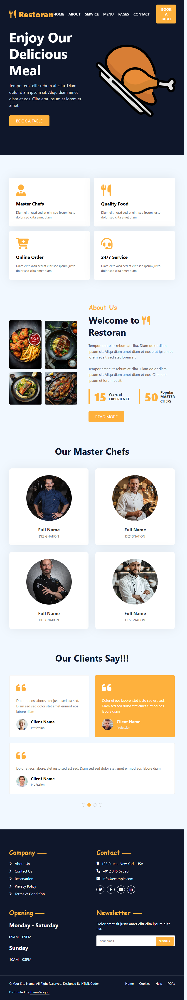

# 🍴 Restoran - Modern Restaurant Website


A beautifully designed, fully responsive restaurant website template. This project features a modern UI with a hero section, service highlights, an about page, a team section showcasing master chefs, and client testimonials. 

🌍 **Live Demo:** [Click here to view the live website](https://mohamedGhareeb20.github.io/Restoran-Web-Project/)

---

## 📸 App Preview
*(Note to team: Take a screenshot of the live site, save it as `preview.png` in the `assets/images/` folder, and it will appear here!)*



---

## ✨ Features
* **Modern UI/UX:** Clean, appetizing design with a dark background and vibrant orange accents.
* **Animated Elements:** Spinning plate animation in the hero section and hover effects on cards.
* **Service Cards:** Highlighted features (Master Chefs, Quality Food, Online Order, 24/7 Service).
* **Team Section:** Display of the restaurant's top chefs.
* **Testimonials:** Interactive-looking client review section.
* **Comprehensive Footer:** Includes quick links, contact info, business hours, and a newsletter signup.

---

## 📂 Project Structure

This project follows professional web development folder structures:

```text
Restoran-Web-Project/
│
├── assets/
│   └── images/          # All project images (kebab-case naming)
│
├── css/
│   └── style.css        # Main stylesheet
│
├── index.html           # Main HTML structure
└── README.md            # Project documentation
